# 🛒 OrderFlow API


API RESTful para **gerenciamento comercial completo** — clientes, fornecedores, produtos, pedidos, pagamentos e controle de estoque. Desenvolvida com **ASP.NET Core 8** seguindo os princípios de **Clean Architecture**.

---

## 🚀 Funcionalidades

- ✅ **Autenticação JWT** — Login seguro com controle de perfis (Admin, Manager, Seller)
- ✅ **Clientes** — CRUD completo com paginação, filtros por nome e cidade
- ✅ **Fornecedores** — CRUD com controle de acesso por perfil
- ✅ **Categorias** — Gerenciamento de categorias de produtos
- ✅ **Produtos** — CRUD com SKU único, margem de lucro e alerta de estoque mínimo
- ✅ **Pedidos** — Criação com baixa automática de estoque e controle de status
- ✅ **Pagamentos** — Registro com validação de valor e confirmação automática do pedido
- ✅ **Estoque** — Movimentações de entrada, saída e ajuste com histórico completo
- ✅ **Dashboard** — Resumo gerencial com totais, pedidos pendentes e vendas por período
- ✅ **Soft Delete** — Registros nunca são deletados fisicamente
- ✅ **Paginação** — Todos os endpoints de listagem são paginados
- ✅ **Validação** — Regras de negócio com FluentValidation
- ✅ **Seed automático** — Banco populado automaticamente na primeira execução

---

## 📸 Screenshots

### Autenticação JWT
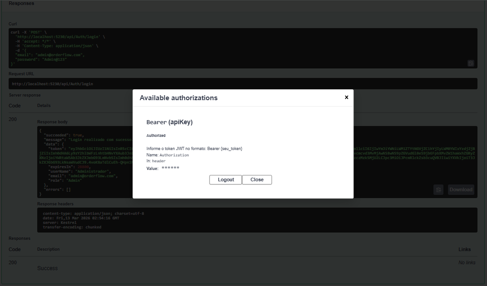

### Categorias
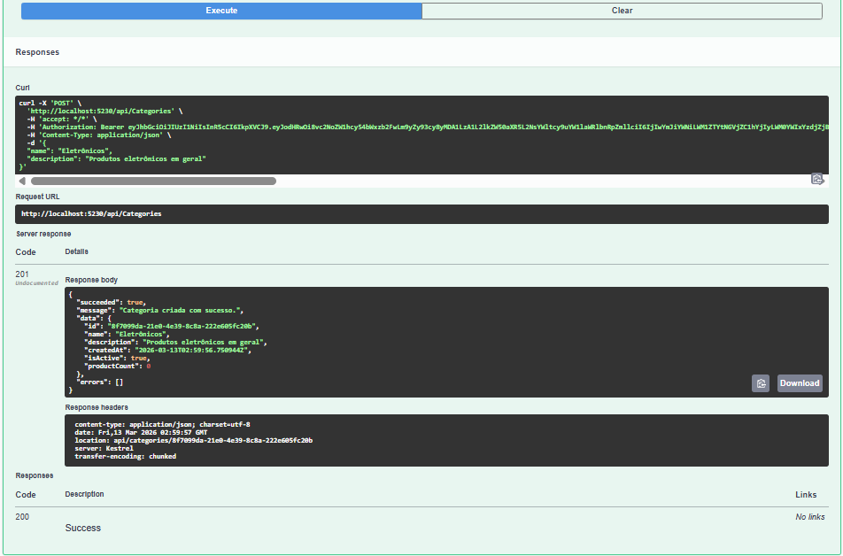
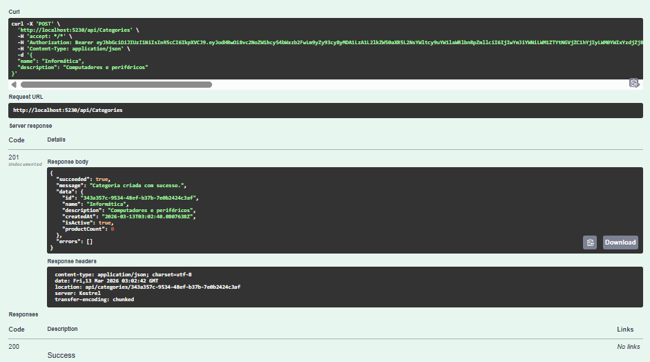
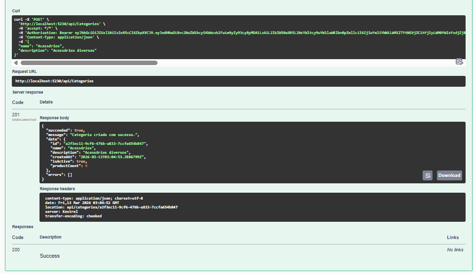
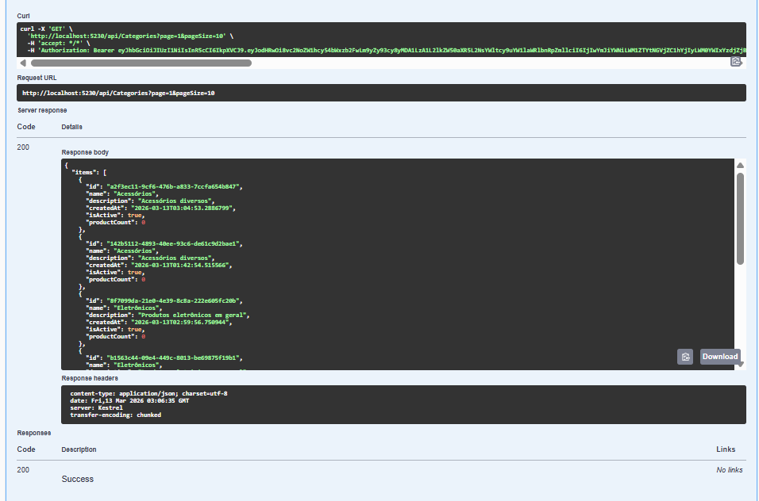

### Fornecedores
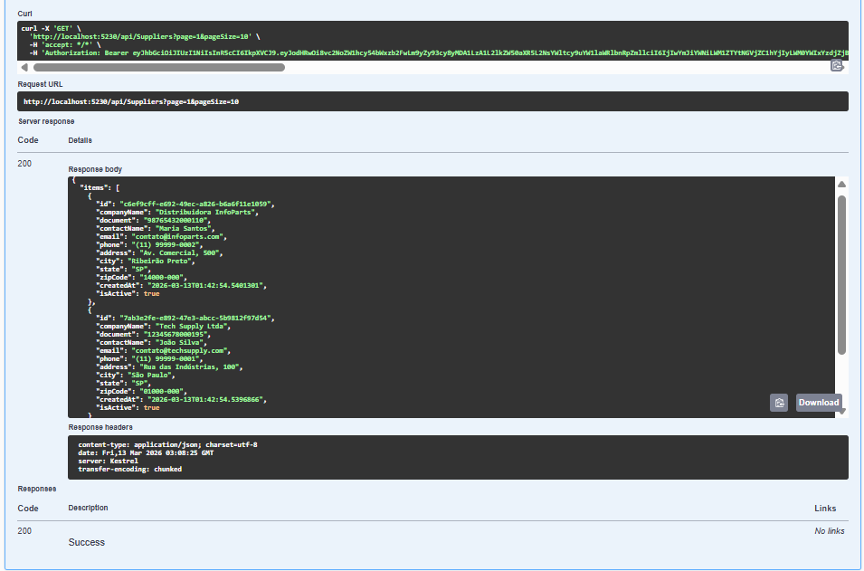

### Produtos
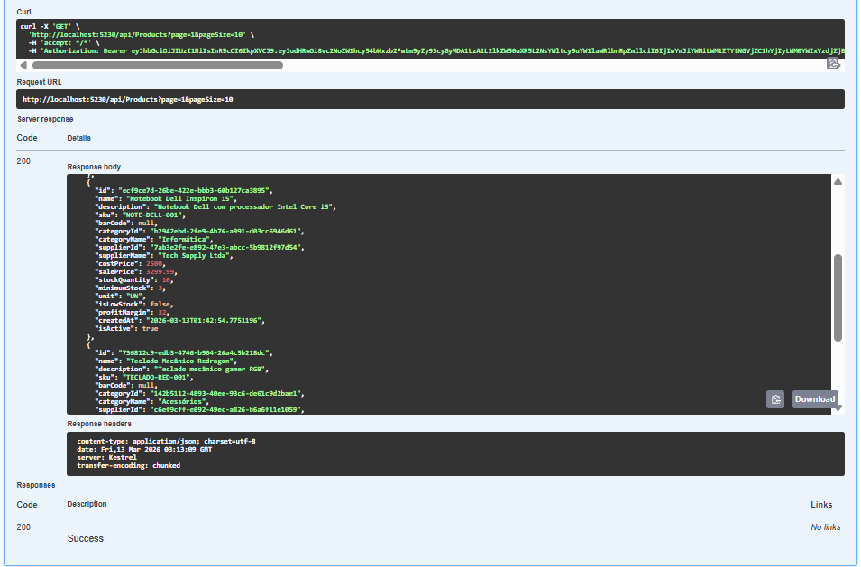

### Clientes
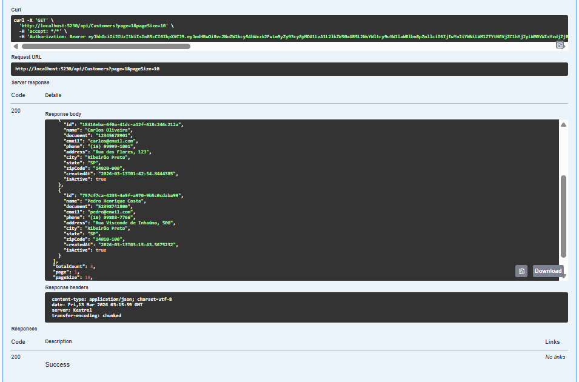

### Pedidos
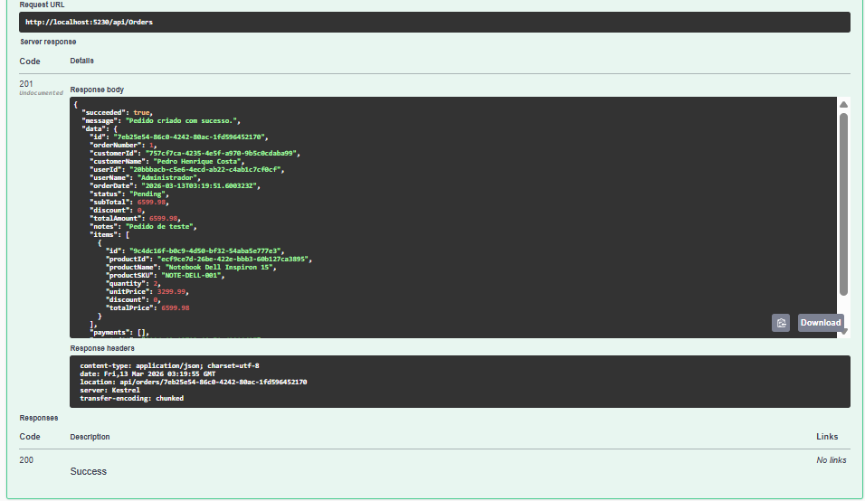
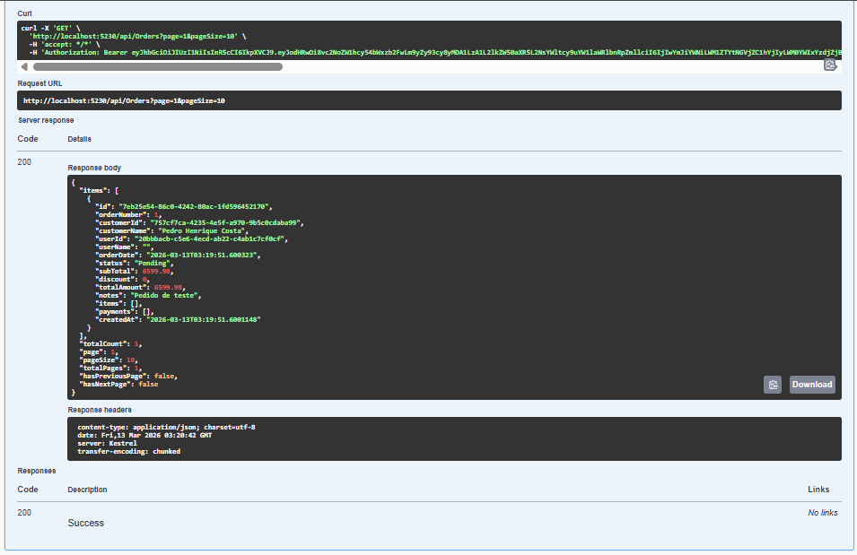

### Pagamentos
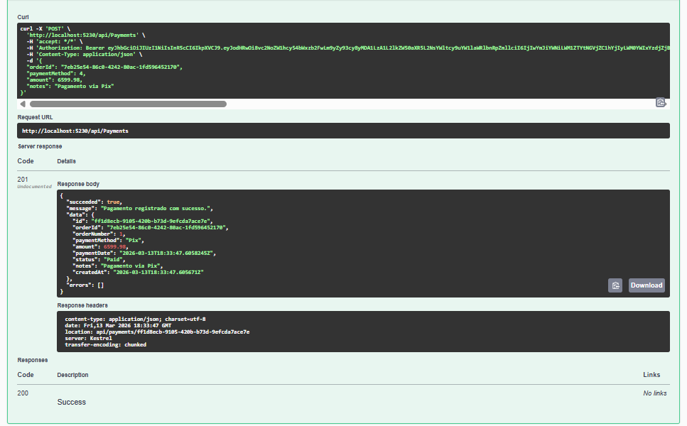

### Estoque
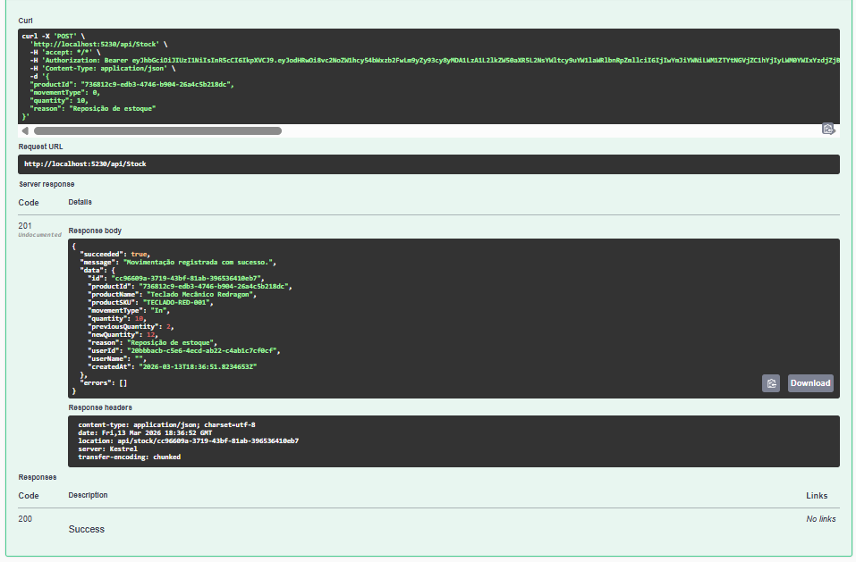

### Dashboard
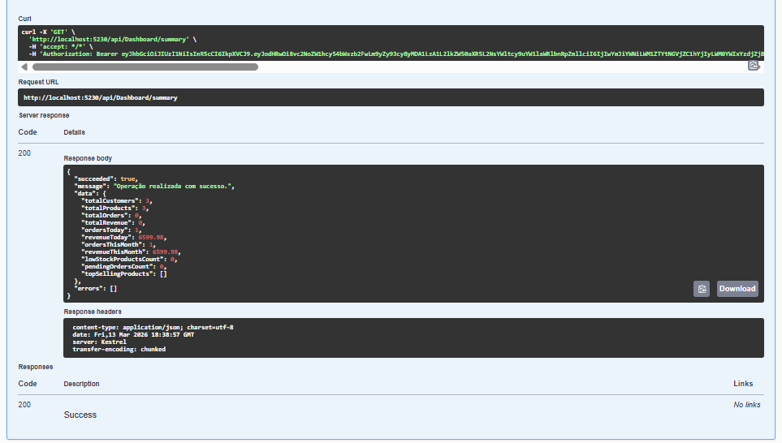

## 🏗️ Arquitetura

Projeto estruturado em **4 camadas** seguindo os princípios de **Clean Architecture**:
```
OrderFlow/
├── src/
│   ├── OrderFlow.API/           # Controllers, Middlewares, Configurações
│   ├── OrderFlow.Application/   # DTOs, Services, Validators, Interfaces
│   ├── OrderFlow.Domain/        # Entidades, Enums, Exceções, Interfaces
│   └── OrderFlow.Infrastructure/# DbContext, Mappings, Repositórios, JWT
└── tests/
    └── OrderFlow.Tests/         # Testes unitários
```

**Fluxo:** Controller → Service → Repository → DbContext

---

## 🛠️ Tecnologias

| Tecnologia | Uso |
|---|---|
| ASP.NET Core 8 | Framework web |
| Entity Framework Core 8 | ORM com Code First |
| SQL Server | Banco de dados relacional |
| JWT Bearer | Autenticação e autorização |
| AutoMapper 12 | Mapeamento Entity ↔ DTO |
| FluentValidation | Validação de dados |
| Serilog | Logging estruturado |
| Swagger/OpenAPI | Documentação interativa |
| xUnit + Moq | Testes unitários |
| Docker | Containerização |

---

## ⚙️ Como Rodar Localmente

### Pré-requisitos
- [.NET 8 SDK](https://dotnet.microsoft.com/download/dotnet/8)
- [SQL Server](https://www.microsoft.com/sql-server) ou [Docker](https://www.docker.com)

### Com Docker (recomendado)
```bash
docker-compose up -d
```

A API estará disponível em `http://localhost:5230`

### Sem Docker
```bash
# 1. Clone o repositório
git clone https://github.com/degasdegani/OrderFlow.git
cd OrderFlow

# 2. Configure a connection string em src/OrderFlow.API/appsettings.json

# 3. Execute a aplicação
dotnet run --project src/OrderFlow.API
```

> A migration e o seed são executados **automaticamente** na primeira execução.

---

## 🔐 Autenticação

A API utiliza **JWT Bearer**. Para acessar endpoints protegidos:

1. Faça login em `POST /api/Auth/login`
2. Copie o token retornado
3. No Swagger, clique em **Authorize** e informe: `Bearer {seu_token}`

### Usuários padrão (seed)

| E-mail | Senha | Perfil |
|--------|-------|--------|
| admin@orderflow.com | Admin@123 | Admin |
| gerente@orderflow.com | Gerente@123 | Manager |
| vendedor@orderflow.com | Vendedor@123 | Seller |

---

## 📁 Estrutura do Banco de Dados
```
Users
├── Orders
│   ├── OrderItems
│   │   └── Products
│   │       ├── Categories
│   │       └── Suppliers
│   └── Payments
├── Customers
│   └── Orders
└── StockMovements
    └── Products
```

---

## 🧪 Testes
```bash
dotnet test
```

11 testes unitários cobrindo os principais services da aplicação.

---

## 📐 Padrões utilizados

- **Repository Pattern** — Abstração do acesso a dados
- **Unit of Work** — Gerenciamento de transações
- **DTO Pattern** — Transferência de dados entre camadas
- **Global Exception Middleware** — Tratamento centralizado de erros
- **Soft Delete** — Deleção lógica de registros
- **Fluent API** — Mapeamento do banco de dados sem Data Annotations

---

## 👨‍💻 Autor

**Eduardo Degani** — Desenvolvedor .NET em transição de carreira

[](https://www.linkedin.com/in/eduardo-degani/)
[](https://github.com/degasdegani)